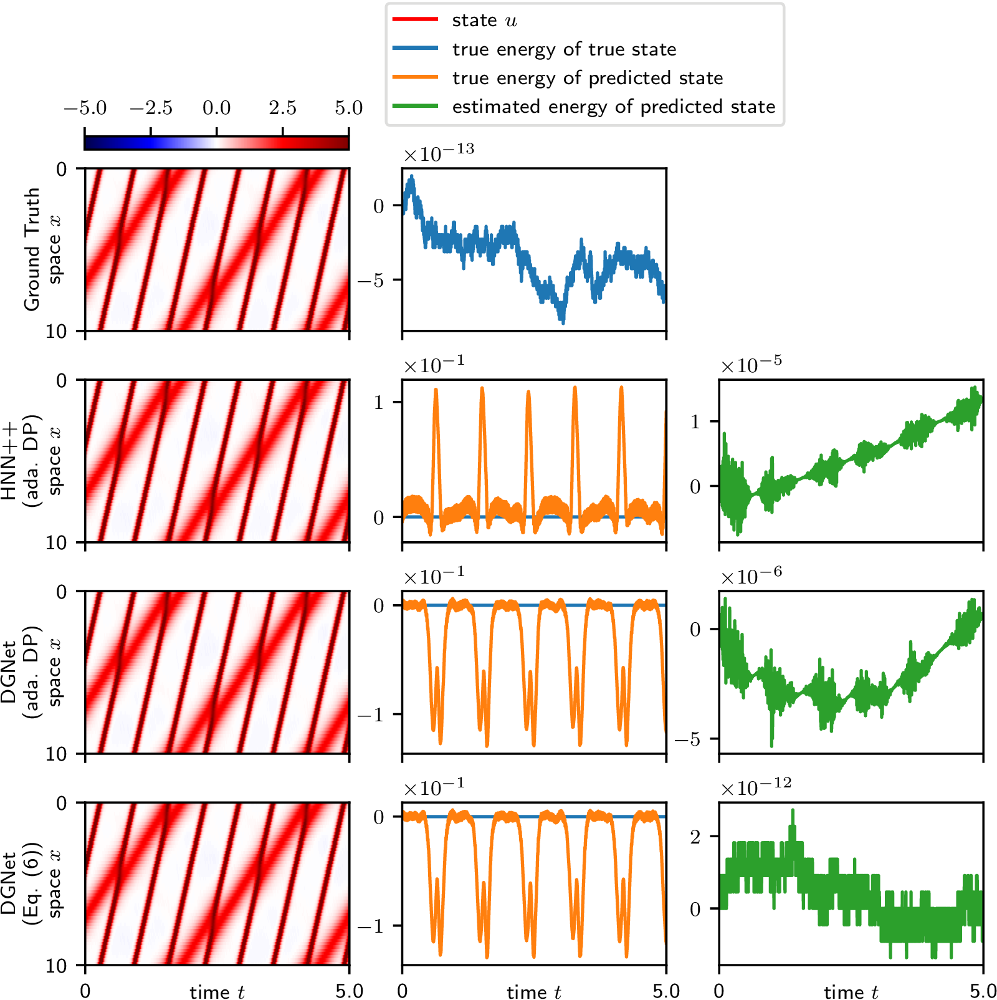
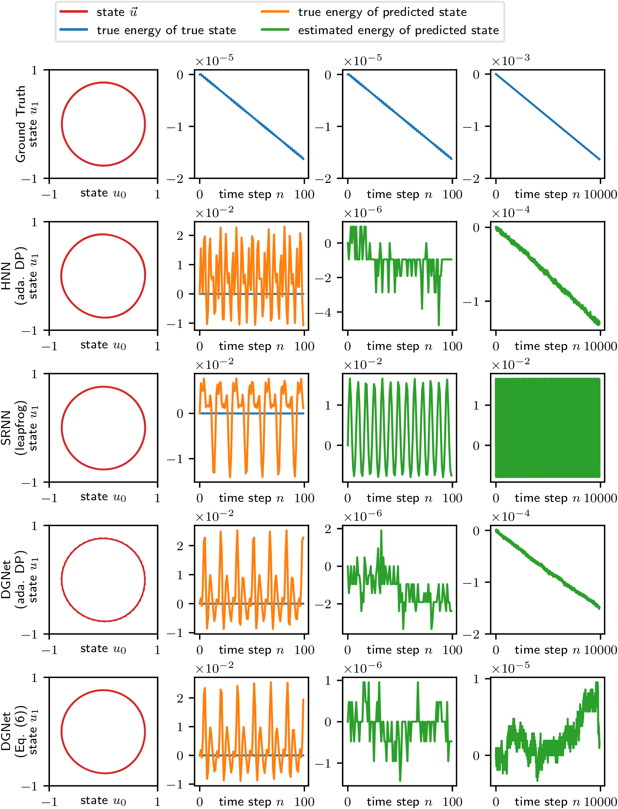

# DGNet: Deep Energy-based Modeling of Discrete-Time Physics

Physical phenomena in the real world are often described by energy-based modeling theories, such as Hamiltonian mechanics or the Landau theory, which yield various physical laws.
Recent developments in neural networks have enabled the mimicking of the energy conservation law by learning the underlying continuous-time differential equations.
However, this may not be possible in discrete time, which is often the case in practical learning and computation.
Moreover, other physical laws have been overlooked in the previous neural network models.
In this study, we propose a deep energy-based physical model that admits a specific differential geometric structure.
From this structure, the conservation or dissipation law of energy and the mass conservation law follow naturally.
To ensure the energetic behavior in discrete time, we also propose an automatic discrete differentiation algorithm that enables neural networks to employ the discrete gradient method.

## Requirements

- Python v3.7.3
- numpy v1.16.2
- scipy v1.2.1
- PyTorch v1.4.0
- [torchdiffeq v0.0.1](https://github.com/rtqichen/torchdiffeq)
- [Hamiltonian Neural Networks](https://github.com/greydanus/hamiltonian-nn)

Please download the code of HNN, and overwrite it with our code.

## Training and Evaluation

To choose a dataset:

| Datasets     |                      | Programs and Options                      |
|:-------------|:---------------------|:------------------------------------------|
| PDE datasets | KdV equation         | `experiment-ch/train_dgnet.py --name kdv` |
|              | CH equation          | `experiment-ch/train_dgnet.py --name ch`  |
| ODE datasets | mass-spring system   | `experiment-spring/train_dgnet.py`        |
|              | pendulum system      | `experiment-pend/train_dgnet.py`          |
|              | 2-body problem       | `experiment-2body/train_dgnet.py`         |
|              | real pendulum system | `experiment-real/train_dgnet.py`          |

To choose a model and integrator:

| Model | Integrator |            | Options                               |
|:------|:-----------|------------|:--------------------------------------|
|       | Training   | Prediction |                                       |
| NODE  | RK2        | RK2        | `--model node   --solver midpoint`    |
|       | ada. DP    | ada. DP    | `--model node   --solver dopri5`      |
| HNN++ | RK2        | RK2        | `--model hnn    --solver midpoint`    |
|       | ada. DP    | ada. DP    | `--model hnn    --solver dopri5`      |
| SRNN  | leapfrog   | leapfrog   | `--model sephnn --solver leapfrog`    |
| DGNet | Eq. (6)    | RK2        | `--model hnn    --solver dg,midpoint` |
|       | Eq. (6)    | ada. DP    | `--model hnn    --solver dg,dopri5`   |
|       | Eq. (6)    | Eq. (6)    | `--model hnn    --solver dg`          |

Then, a typical command to reproduce our results is

```sh
python experiment-ch/train_dgnet.py --name ch --model hnn --solver dg --seed 0 --verbose
```

Results are stored in `experiment-*/results/`.

## Results



The results on KdV equation.
The proposed scheme provides a comparable result to the Dormand-Prince method with the adaptive time-stepping (see the left and center columns).
The proposed scheme conserves the system energy within a range of the rounding error while the Dormand-Prince method suffers from the energy drift (see the right column).



The results on mass-spring system.
With the leapfrog integrator, the system energy is fluctuating over a wide range because the integrator conserves the modified energy instead of the original system energy.

## Numerical Results

Each result is an average over 15 trials.
For PDE datasets, we used NVIDIA TITAN V; two for HNN+ada. DP and one for the others.
For ODE datasets, we used one NVIDIA GeForce 2080Ti.

Results on the PDE datasets

| Model | Integrator |            | KdV equation |             |             | Cahn-Hilliard equation |             |             |
|:------|:-----------|------------|:-------------|:------------|:------------|:-----------------------|:------------|:------------|
|       | training   | prediction | derivative   | energy      | mass        | derivative             | energy      | mass        |
| NODE  | RK2        | RK2        | 1.15e1       | 4.57e4      | 2.86e0      | 7.91e2                 | 1.43e-2     | 9.15e-1     |
|       | ada. DP    | ada. DP    | 1.15e1       | 5.58e4      | 2.84e0      | 7.90e2                 | 1.42e-2     | 9.14e-1     |
| HNN++ | RK2        | RK2        | 3.63e-2      | 6.32e-3     | 7.00e-4     | 3.44e2                 | 1.33e-1     | 8.76e-2     |
|       | ada. DP    | ada. DP    | *2.33e-2*    | 3.01e-3     | 3.35e-4     | *3.30e1*               | 4.89e-6     | 7.95e-4     |
| DGNet | Eq. (6)    | RK2        | **1.75e-2**  | 1.84e-3     | 2.78e-4     | **7.14e0**             | 6.61e0      | 8.22e-1     |
|       | Eq. (6)    | ada. DP    | (ditto)      | **1.60e-3** | **2.54e-4** | (ditto)                | **3.39e-7** | **6.95e-5** |
|       | Eq. (6)    | Eq. (6)    | (ditto)      | **1.60e-3** | *2.55e-4*   | (ditto)                | *3.40e-7*   | *6.96e-5*   |

Results on the conservative ODE datasets
| Model | Integrator |            | Mass-Spring |             | Pendulum    |             | 2-Body      |             |
|:------|:-----------|:-----------|:------------|:------------|:------------|:------------|:------------|:------------|
|       | training   | prediction | derivative  | energy      | derivative  | energy      | derivative  | energy      |
| NODE  | RK2        | RK2        | 5.27e-2     | 5.70e-1     | 5.67e-2     | 4.60e0}     | 2.08e-5     | 1.44e-1     |
|       | ada. DP    | ada. DP    | 5.57e-2     | 5.74e-1     | 5.54e-2     | 4.62e0}     | 2.07e-5     | 1.83e-1     |
| HNN   | RK2        | RK2        | **3.82e-2** | 6.13e-2     | 4.25e-2     | 4.04e-1     | *5.39e-6*   | 9.39e-5     |
|       | ada. DP    | ada. DP    | 3.99e-2     | 1.74e-3     | 4.09e-2     | 1.66e-2     | 6.21e-6     | 8.18e-5     |
| SRNN  | leapfrog   | leapfrog   | 3.95e-2     | 6.90e-4     | **3.92e-2** | *1.12e-2*   | **4.36e-6** | **4.04e-5** |
| DGNet | Eq. (6)    | RK2        | *3.85e-2*   | 6.13e-2     | *3.93e-2*   | 7.43e-1     | 7.80e-6     | 8.11e-5     |
|       | Eq. (6)    | ada. DP    | (ditto)     | **6.16e-4** | (ditto)     | 1.61e-2     | (ditto)     | *8.10e-5*   |
|       | Eq. (6)    | Eq. (6)    | (ditto)     | *6.17e-4*   | (ditto)     | **1.08e-2** | (ditto)     | *8.10e-5*   |

Results on the dissipative ODE dataset
| Model | Integrator |            | Real pendulum |             |
|:------|:-----------|:-----------|:--------------|:------------|
|       | training   | prediction | difference    | energy      |
| NODE  | RK2        | RK2        | *1.38e-3*     | 6.22e-4     |
|       | ada. DP    | ada. DP    | **1.37e-3**   | 5.88e-4     |
| HNN   | RK2        | RK2        | 1.42e-3       | 2.86e-3     |
|       | ada. DP    | ada. DP    | 1.41e-3       | 3.44e-3     |
| SRNN  | leapfrog   | leapfrog   | (1.38e-3)     | (9.63e-3)   |
| DGNet | Eq. (6)    | RK2        | *1.38e-3*     | 8.63e-4     |
|       | Eq. (6)    | ada. DP    | (ditto)       | **4.92e-4** |
|       | Eq. (6)    | Eq. (6)    | (ditto)       | *5.04e-4*   |


## Reference

```bibtex
@inproceedings{Matsubara2020,
  title = {Deep Energy-Based Modeling of Discrete-Time Physics},
  author = {Takashi Matsubara, Ai Ishikawa, and Takaharu Yaguchi},
  booktitle = {Advances in Neural Information Processing Systems 33 (NeurIPS2020)},
  url={https://arxiv.org/abs/1905.08604},
  year = {2020}
}
```
